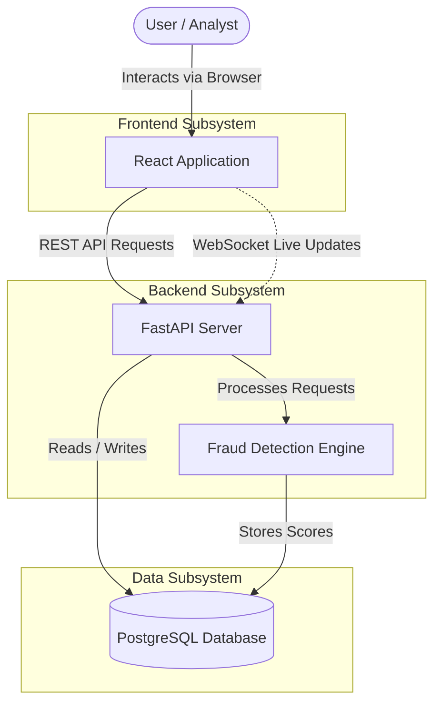
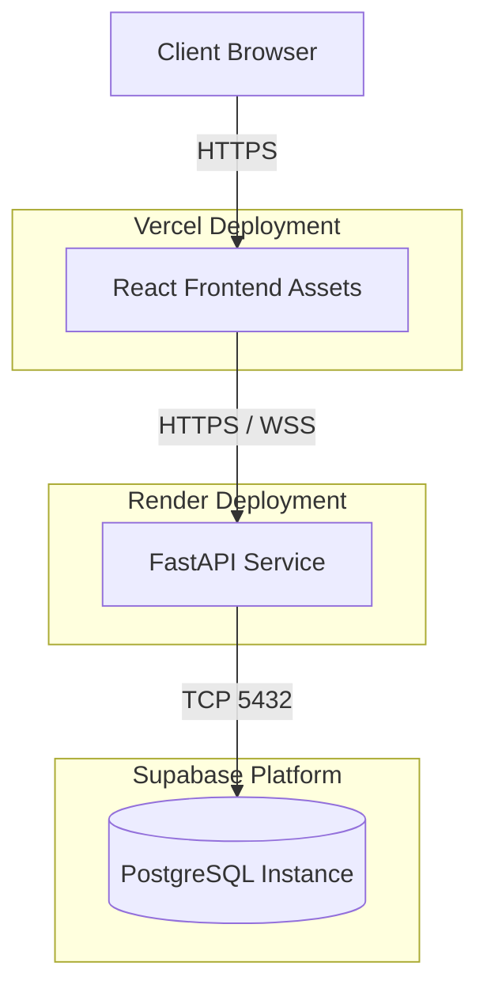
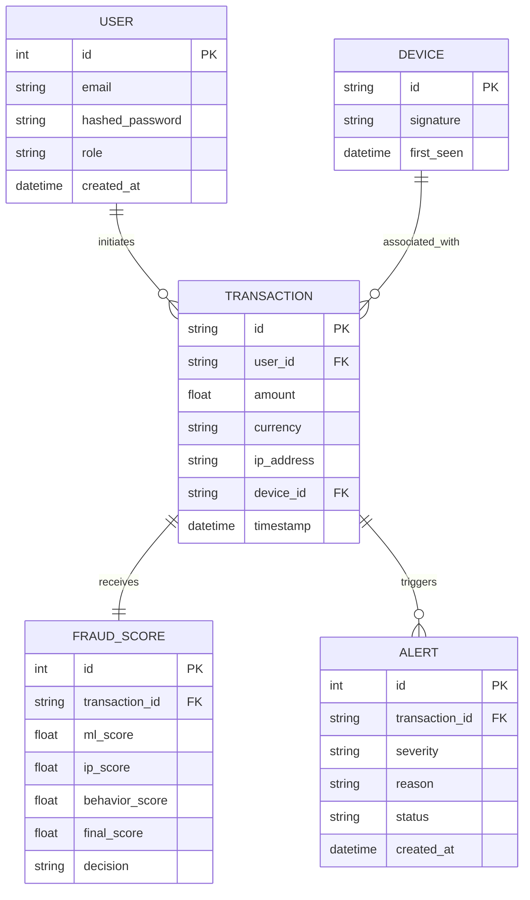
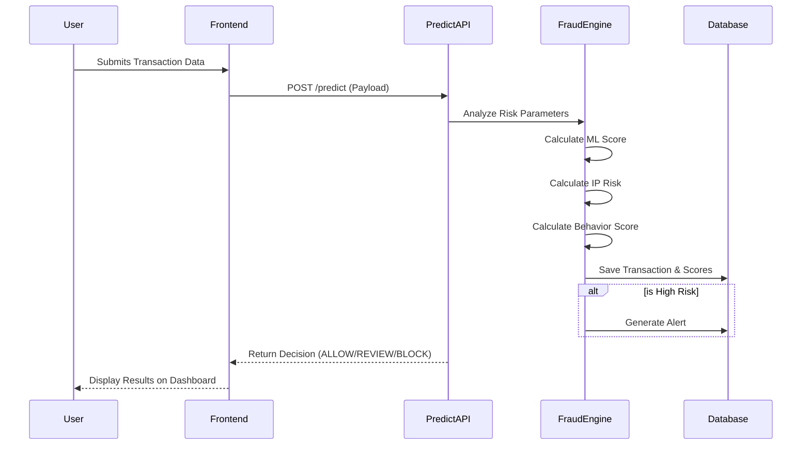
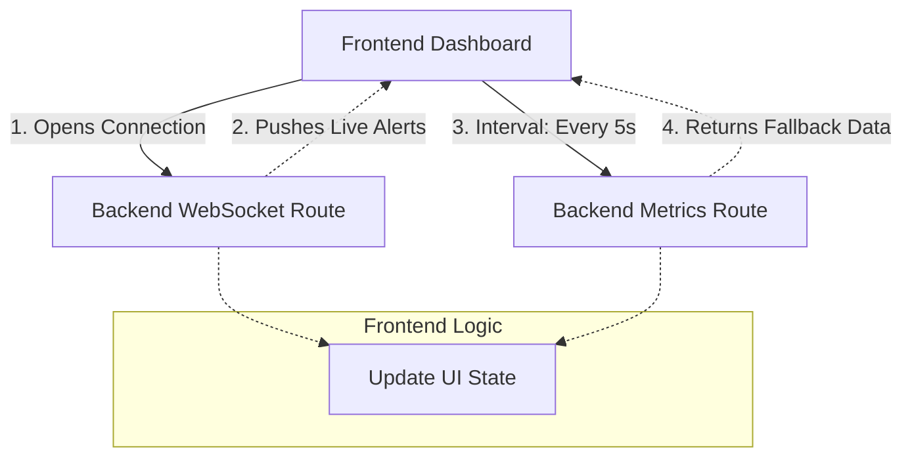
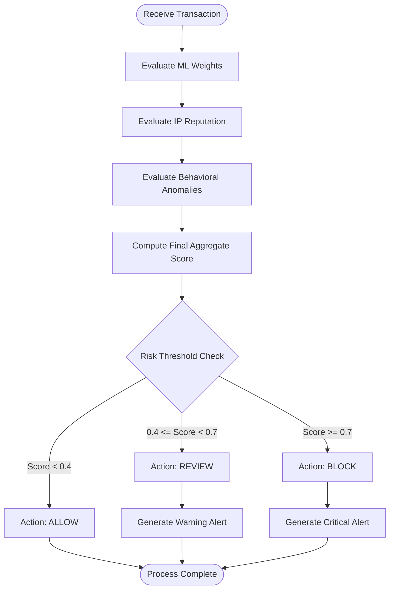
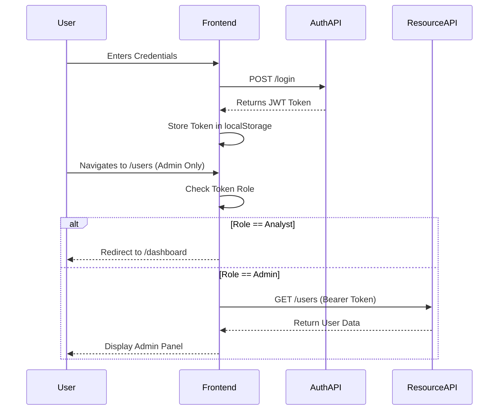
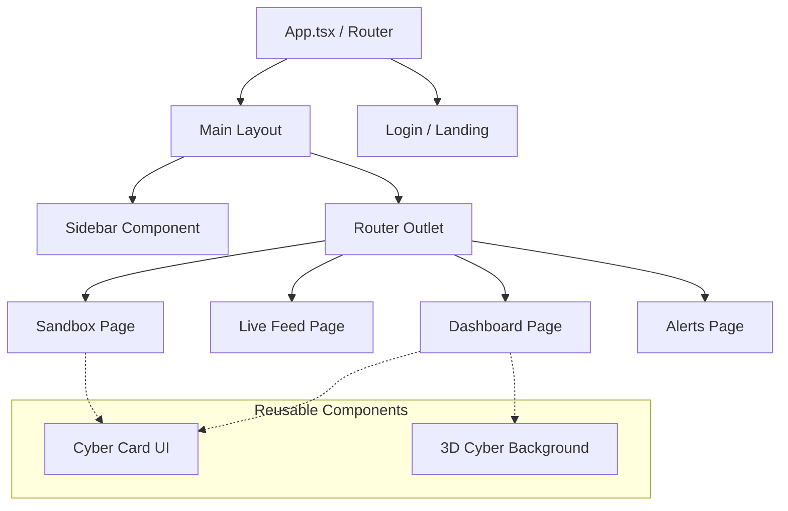

# Fortress X Architecture Documentation

This document provides a comprehensive architectural overview of the Fortress X fraud detection system. The diagrams follow an academic, black-and-white standard using Mermaid syntax.

## 1. System Architecture (C4 Model)
This diagram illustrates the high-level flow of the Fortress X system. It demonstrates how external users interact with the React frontend, which in turn communicates with the FastAPI backend and PostgreSQL database via REST APIs and WebSockets.

## 2. Deployment Diagram
This diagram outlines the cloud deployment topology. It shows the distribution of the system across Vercel for static asset hosting, Render for backend execution, and Supabase for managed database services.

## 3. Entity-Relationship (ER) Diagram
This diagram details the relational database schema of the system. It highlights the primary entities, their attributes, and the foreign key constraints mapping Users, Transactions, Scores, Alerts, and Devices.

## 4. Fraud Prediction Sequence Diagram
This sequence diagram captures the operational flow of processing a transaction. It traces the path from the initial user input through the prediction engines and down to the final database persistence and UI update.

## 5. Real-Time Communication Flow
This diagram illustrates the dual-strategy synchronization mechanism used by the frontend dashboard. It relies on a primary WebSocket connection for immediate updates, backed by a robust interval polling mechanism.

## 6. Fraud Detection Activity Diagram
This activity diagram demonstrates the conditional logic applied to an incoming transaction. It maps out how the combination of three independent scoring models results in one of three definitive actions.

## 7. Authentication & Authorization Sequence
This diagram details the security lifecycle within Fortress X. It explains the acquisition, storage, and validation of JSON Web Tokens (JWT), as well as the implementation of Role-Based Access Control (RBAC).

## 8. Frontend Component Diagram
This diagram maps the hierarchical structure of the React frontend application. It visualizes how routing encapsulates layout logic, which in turn renders specific pages and reusable UI artifacts.

